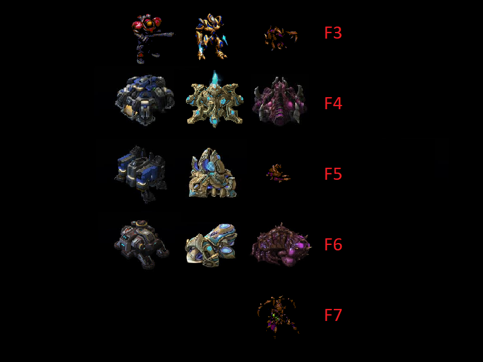

## Starcraft 2: Select all hotkeys - extension mod and dependent mod library

Mod file for the extension mod that can be played on custom melee games on BNet.

Plus, mod file for the library that can be import in any other mod.

## Extension mod usage
* F3 - Select all army units that are not in any control groups
* F4 - Select all base buildings
* F5 - Select all production buildings & larvae
* F6 - Select all tech and upgrade buildings
* F7 - Select all Queens

